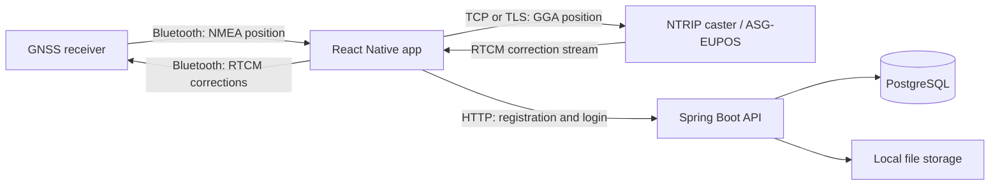

# Dual GPS

A mobile GNSS companion app with a Java backend. Dual GPS connects an Android phone to an external satellite positioning receiver over Bluetooth, displays live position data, and forwards network correction data to the receiver for RTK positioning.

The project combines mobile development, hardware communication, binary stream processing, and a REST API backed by PostgreSQL.

## Features

- **Bluetooth receiver connection:** lists paired devices and offers Topcon and Kolida profiles. Topcon sends configuration commands; Kolida currently uses the receiver's existing configuration.
- **Live positioning data:** latitude, longitude, altitude, satellite count, fix quality, and dilution of precision (HDOP, VDOP, PDOP).
- **RTK correction streaming:** connects directly to a configurable NTRIP caster, sends the receiver's GGA position, and forwards RTCM correction bytes over Bluetooth. ASG-EUPOS settings are provided as defaults.
- **Diagnostics:** raw serial messages, connection state, correction byte counters, CRC-checked RTCM frames, and the latest RTCM message type.
- **Authentication:** registration and JWT login through the backend, with native session persistence using Expo SecureStore.
- **Backend file storage:** authenticated uploads and owner-restricted downloads, with metadata in PostgreSQL. These endpoints are not yet connected to a frontend file management screen.

RTK uses correction data to improve a receiver's positioning solution. NTRIP delivers those corrections over a network; NMEA carries receiver position messages, and RTCM carries correction data.

## Technology stack

| Area                           | Technologies                                                               |
| ------------------------------ | -------------------------------------------------------------------------- |
| Mobile frontend                | TypeScript, React 19.1, React Native 0.81.5, Expo SDK 54                   |
| Navigation and UI              | Expo Router, React Native Paper                                            |
| Hardware and networking        | Bluetooth Classic, native TCP/TLS sockets, NMEA parsing, RTCM 3 inspection |
| Backend                        | Java 25, Spring Boot 4.1.1, Spring MVC, Spring Security                    |
| Persistence and authentication | PostgreSQL 17, Spring Data JPA, JWT, BCrypt                                |
| Tooling                        | Maven Wrapper, Docker Compose, ESLint, TypeScript                          |

Versions reflect the repository's dependency manifests.

## Architecture



The correction stream runs directly between the phone, caster, and receiver. The backend handles accounts and file storage separately.

## Engineering highlights

- **Incremental protocol parsing:** handles fragmented NTRIP headers and chunked response bodies, validates NMEA checksums and coordinate ranges, and inspects RTCM frames with CRC24Q checks.
- **Stream lifecycle management:** serializes Bluetooth writes, pauses socket reads when pending writes accumulate, detects connection and correction timeouts, and retries NTRIP connections with increasing delays.
- **Shared mobile state:** React context and hooks keep authentication, receiver connections, correction status, and saved settings available across screens.
- **Backend separation of concerns:** feature packages separate HTTP controllers, application services, domain models, repositories, and file storage behind an interface.
- **File handling under failure:** removes partial writes and cleans up uploaded content if metadata persistence fails. Downloads open streams lazily and check the authenticated owner.
- **Backend tests:** cover file validation, ownership, authentication, response headers, path restrictions, stream closure, and failure cleanup.

## Run locally

For this app's intended RTK setup, **two GNSS receivers are required, each supporting at least L1 and L2 frequencies**, to establish an RTK fix.

For a full hardware demo, also use an Android phone, Bluetooth Classic connectivity to the receiver, internet access, and credentials for an NTRIP service. An emulator can help review the UI and authentication; the receiver workflow needs real hardware and a native app build.

### Backend

The entire backend, including both the Spring Boot API and PostgreSQL database, can run in Docker. Install Docker with Compose; no local Java or Maven installation is needed for this option. From the repository root:

```powershell
cd DualGpsBackend
docker compose build backend
docker compose up -d database
docker compose run --rm --service-ports -e FILE_STORAGE_ROOT=/tmp/dualgps-uploads backend
```

These commands run both components in containers and use a temporary writable upload directory to work around the current image's storage permissions. Uploaded files are lost when the API container is removed; database data persists in a Docker volume. The API is available at `http://localhost:8080`.

See the [backend README](DualGpsBackend/README.md) for persistent storage notes, configuration, API examples, tests, and the alternative local Java setup.

### Frontend

Install Node.js compatible with SDK 54 (minimum 20.19.x), npm, and the Android build tools. See the [Expo SDK compatibility reference](https://docs.expo.dev/versions/v54.0.0/).

In a separate terminal:

```powershell
cd dualGpsFrontend
npm install
Copy-Item .env.example .env
```

Set the backend addresses in `.env`:

```dotenv
EXPO_PUBLIC_API_URL_EMULATOR=http://10.0.2.2:8080
EXPO_PUBLIC_API_URL_DEVICE=http://192.168.1.100:8080
```

Replace `192.168.1.100` with your computer's LAN address. The phone must be able to reach that address. Build and install the Android app:

```powershell
npx expo run:android --device
```

Bluetooth Classic and TCP sockets require native modules, so Expo Go cannot run the complete workflow. See the [frontend README](dualGpsFrontend/README.md) for the receiver walkthrough and troubleshooting.
